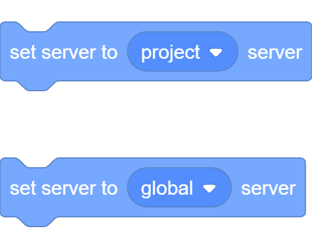
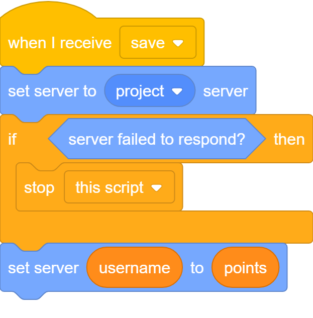

# Storage

Storage is an extension which allows you to save and get the value of variables which are either stored on the user's computer or on the PenguinMod servers.

## Local Storage

<mark style="color:yellow;">This section is not documented yet.</mark>


## Local Uploaded Project Storage

<mark style="color:yellow;">This section is not documented yet.</mark>


## Server Storage

Server Storage is a section in the Storage extension that allows you to use a PenguinMod server or your own server to save data.


<mark style="color:yellow;">This is not a fully secure form of storage in its current state, as it can still be modified by users.</mark>


This block will return ``true`` if any keys being made are currently accessible by every project using this same server. If you are using an external server, this value will always be ``true``.

Using this block will set the server being used to store data to either the global server (every project can access this) or the project server (only this project can access these variables). The catch is that to use the project server, the project needs to be uploaded as it uses the project's ID to know which keys the project can access.

### Bonus Functionality
You can also use this block to use external servers by using any block that returns a string and putting it into the server type input. The server will have to have a main ``/`` page and a ``get``, ``set``, and ``delete`` page (with ``set`` being a post request and ``delete`` being a delete request) in-order for it to work properly. The status code should ideally be 200 for every successful request and anything not between 200-299 for failing requests.

This block will return ``true`` if any blocks are currently waiting for a response. This will become ``false`` instantly after the action has been completed. The only main reason to use this is for drawing loading bars or loading spinners if you are doing that outside of the script that is doing the actions.

This block will return ``true`` if any server actions have been attempted but not successful. Use this after setting a value to see if something went wrong or not. This is useful if you are setting a value after the server has gone offline.

If &lt;server failed to respond?&gt; is true, this block will contain the error that occurred.

This will get the value of a key with this name on the server.

This will set the value of a key with this name on the server to the value given.

This will delete a key with this name on the server.

As a security measure, there are no blocks to get all of the keys set on a server. This is because users can use this to get all of the keys set and delete them all. If you really need this functionality and are willing to sacrifice some security for it, use another server variable to store which keys the project has set.

# Examples

This code will set the current server to the PenguinMod server and tell it to only use values from this project. It stops the script if it failed to set the server (ex: the server is offline), and then sets a key named the user's username to the amount of points the user has if the script was not stopped. 

# Credits

Storage is developed by [JeremyGamer13](../developers/jeremygamer13.md), originally suggested by Fir and silvxrcat in the PenguinMod Discord for an event.
